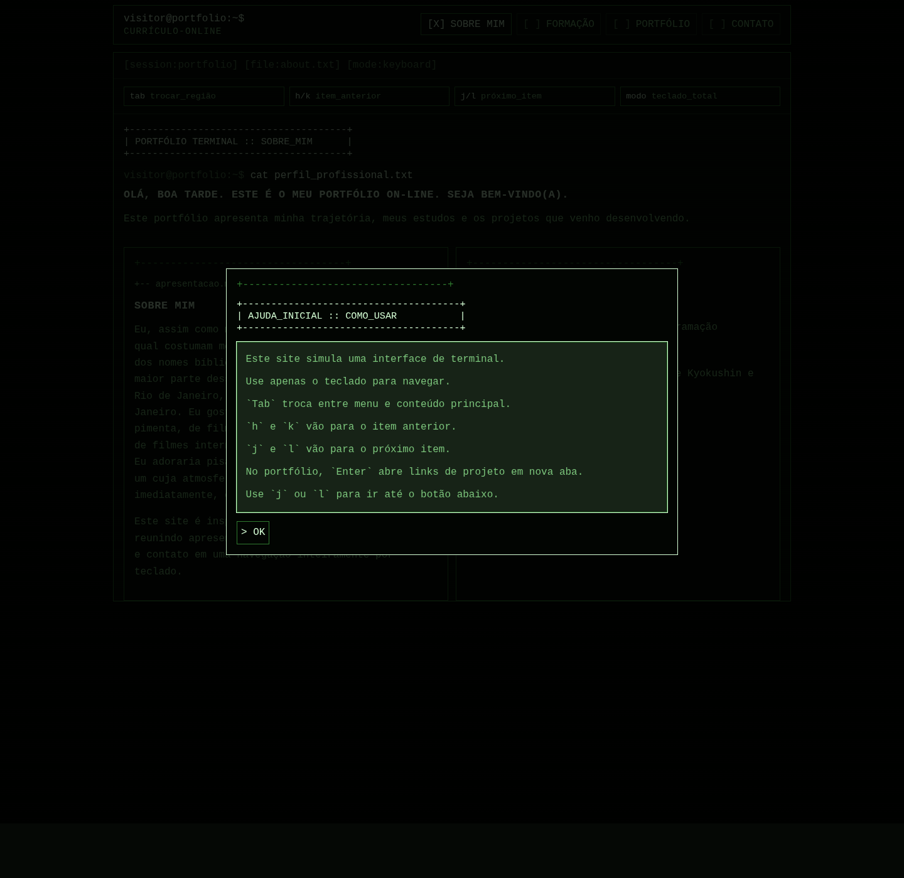

# Portfólio Terminal

Site pessoal em HTML, CSS e JavaScript com visual inspirado em terminal. O projeto apresenta informações pessoais, formação acadêmica, portfólio e uma página de contato em uma experiência pensada para navegação por teclado.



## Visão geral

O website foi construído como um portfólio estático com estética de linha de comando. A interface usa painéis, banners em ASCII e atalhos de teclado para reforçar a proposta visual e de interação.

As páginas principais são:

- `index.html`: apresentação pessoal e hobbies.
- `education.html`: formação acadêmica, cursos e idiomas.
- `portfolio.html`: projetos e repositórios em destaque.
- `contact.html`: formulário de contato com navegação própria por teclado.

## Tecnologias utilizadas

- HTML5
- CSS3
- JavaScript

## Como abrir o site

Como o projeto é estático, ele pode ser aberto de duas formas:

1. Abrir o arquivo `index.html` diretamente no navegador.
2. Servir a pasta com um servidor local simples, se preferir.

Exemplo com Python:

```bash
python3 -m http.server 8000
```

Depois, acesse:

```text
http://localhost:8000
```

## Como usar o website

O site foi desenhado para funcionar principalmente com o teclado.

- `Tab`: alterna entre a região do menu e a região do conteúdo principal.
- `h` ou `k`: move o foco para o item anterior.
- `j` ou `l`: move o foco para o próximo item.
- `Enter`: ativa botões e, na página de portfólio, abre o projeto selecionado em uma nova aba.

## Uso da página de contato

A página `contact.html` possui um comportamento específico para evitar digitação acidental durante a navegação:

- Use `h`, `j`, `k` e `l` para percorrer os campos e botões do formulário.
- Pressione `c` sobre um campo de texto para entrar no modo de edição.
- Pressione `Enter` ou `Esc` para sair do modo de edição.
- Use o botão de envio para validar e enviar a mensagem.

## Estrutura do projeto

```text
.
├── index.html
├── education.html
├── portfolio.html
├── contact.html
├── assets
│   ├── css
│   │   └── main.css
│   ├── images
│   │   └── screenshot-home.png
│   └── js
│       ├── main.js
│       └── contact.js
└── README.md
```

## Objetivo do projeto

O objetivo deste website é apresentar o portfólio de forma autoral, com identidade visual forte e navegação diferenciada, sem depender de frameworks ou bibliotecas externas.
